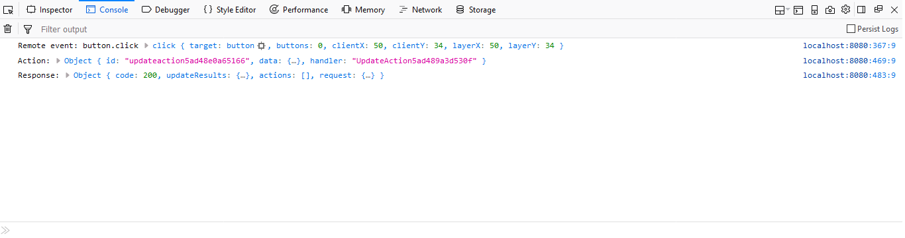
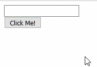

# Capítulo 1. Creando una glue app. #

La mejor forma de comprender la filosofía de trabajo de GluePHP es usándolo en la práctica. Para esto vamos a desarrollar una aplicación muy sencilla pero que servirá para mostrar muy bien los diferentes aspectos del proceso.

La aplicación estará compuesta por una caja de texto, una etiqueta y un botón. La lógica consistirá en que al hacer clic sobre el botón la etiqueta muestre un saludo con el nombre introducido por el usuario en el campo de texto.

>En el archivo [app1.zip](https://github.com/andaniel05/GluePHP/raw/0.1a/doc/res/Cap1/app1.zip) encontrará resuelto el ejercicio de este capítulo.

## Introducción. ##

En el desarrollo con GluePHP existen identificados dos roles principales llamados **desarrollador de aplicación** y **desarrollador de componentes** respectivamente. Es bastante común que los desarrolladores se desempeñen en ambos roles de manera indistinta, pero en cada caso se tienen diferentes tipos de responsabilidades.

El desarrollador de aplicación, como su nombre lo indica, se encarga de realizar las partes del desarrollo relacionadas específicamente con las funcionalidades propias de la aplicación. Este rol se encarga de atender la estructura del proyecto, los controladores, la composición, los eventos y la lógica en general.

Por otra parte, el desarrollador de componentes, se encarga de desarrollar los componentes y otros recursos que serán usados por el desarrollador de aplicación.

Durante el desarrollo de este capítulo y con el objetivo de lograr la mejor explicación posible, primeramente nos desempeñaremos con el rol del desarrollador de aplicación y seguidamente con el de componentes.

> Ninguno de los aspectos mostrados en los siguientes pasos tiene un carácter absoluto por lo que al realizar sus propios proyectos usted debe ser capaz de aplicarlos de acuerdo a sus necesidades.

## 1. Instalando GluePHP. ##

Recomendamos trabajar sobre un directorio vacío para tener un proyecto organizado.

    $ mkdir app1
    $ cd app1

Cree un archivo de nombre *composer.json* con el siguiente contenido:

    {
        "require": {
            "andaniel05/composed-views": "dev-0.1a",
            "andaniel05/glue-php": "dev-0.1a"
        }
    }

Seguidamente ejecute el comando:

    $ composer update

Una vez que halla finalizado la instalación cree un archivo de nombre *bootstrap.php* con el siguiente contenido:

```php
<?php

require_once 'vendor/autoload.php';
```

En este archivo vamos a definir las clases y funciones de la aplicación a medida que avancemos en el capítulo.

## 2. Controladores. ##

Una *glue app* necesita dos controladores web para su funcionamiento.

El primero de ellos se denomina **controlador de carga** ya que es el responsable de entregarle al navegador todo el código HTML de la página única, mientras que el segundo se denomina **controlador de procesamiento** y se encarga de procesar todas las solicitudes asíncronas(ajax) generadas desde el navegador.

La lógica de estos controladores es definida por el usuario, no obstante, es obligatorio que realicen ciertas operaciones para el correcto funcionamiento de la app.

> Si para el desarrollo de la app se está usando algún framework PHP de prósito general, estos controladores se deben crear de la misma manera en la que se crean controladores con dicho framework.

### Creando el controlador de carga. ###

Cree un archivo con nombre *index.php* con el siguiente contenido:

```php
<?php

require_once 'bootstrap.php';

// Se instancia la app con sus componentes y eventos.
$app = require_once 'app.php';

// Se persiste la instancia de la app donde en este caso la persistencia se hace
// mediante la sesión.
session_start();
$_SESSION['app'] = $app;

// Se imprime en el navegador el código HTML de la página.
$app->print();
```

Los comentarios del código muestran las respectivas funcionalidades. Como puede ver, la instancia de la app se obtiene del archivo *app.php* por lo que será en este donde estará definida toda la app.

### Creando el controlador de procesamiento. ###

Cree un archivo de nombre *process.php* con el siguiente contenido:

```php
<?php

require_once 'bootstrap.php';

use Andaniel05\GluePHP\Request\Request;

// Obtiene la instancia de la app persistida por el controlador de carga o por
// el procesamiento anterior.
session_start();
$app = $_SESSION['app'];

// La app procesa la solicitud y devuelve una respuesta.
$request = Request::createFromJSON($_REQUEST['glue_request']);
$response = $app->handle($request);

// Vuelve a persistir la app.
$_SESSION['app'] = $app;

// Envía al navegador la respuesta en formato JSON.
echo $response->toJSON();
die();
```

Puede ver que el código también está comentado.

## 3. Definiendo la app. ##

A partir de este paso es donde realmente comienza el desarrollo de nuestra app, pues crear los controladores fué crear la plataforma básica de ejecución y será siempre un paso obligatorio cuando se desarrolle cualquier *glue app* independientemente de su tamaño.

Cree un archivo de nombre *app.php* con el siguiente contenido:

```php
<?php

/////////////////
// Composición //
/////////////////

// Instancia la app. El primer argumento especifica la ruta del controlador
// de procesamiento.
$app = new App('process.php');
$app->setDebug(true);

// Instancia los componentes. El primer argumento especifica el identificador del componente.
$input = new Input('input');
$label = new Label('label');
$button = new Button('button');

// Inserta los componentes en la sección 'body' de la app.
$app->appendComponent('body', $input);
$app->appendComponent('body', $label);
$app->appendComponent('body', $button);

////////////////////////////
// Vinculación de eventos //
////////////////////////////

// Declara que el evento 'click' del botón será manejado por la función 'clickButton'.
$button->on('click', 'clickButton');

return $app;
```

Primeramente se instancia la app donde el primer argumento se corresponde con la ruta del controlador de procesamiento. Como puede ver seguidamente existen dos bloques de comentarios llamados 'Composición' y 'Vinculación de eventos' respectivamente.

La composición no es más que insertar en la instancia de la app las instancias de los componentes que estarán presentes en la misma, mientras que la vinculación de eventos consiste en especificar las funciones encargadas de manejar los respectivos eventos de los componentes.

> Como manejador de eventos se acepta cualquier tipo de *callback* pero el uso de *closures* puede requerir un tratamiento especial. En el próximo capítulo será abordado este tema.

> La composición también puede efectuarse mediante código XML lo que reduce considerablemente la tarea, pero esto solo será posible si se está usando algún kit preparado para esto. Este tema será abordado en próximos capítulos.

Como se comenta en el código, lo que se hace para nuestra app es crear tres componentes e insertarlos en la sección 'body'. Además, se registra la función 'clickButton' como la encargada de manejar el evento 'click' del botón.

> La vinculación de eventos también se puede realizar sobre la instancia de la app donde el nombre del evento se conforma por el identificador del componente, un punto, y el nombre del evento. En este caso sería `$app->on('button.click', 'clickButton');`.

Cada componente posee un identificador con el objetivo de que el mismo pueda ser referenciado desde cualquier parte del código. Por lo general este identificador es especificado por el usuario a través del constructor de la clase aunque esto depende del diseño de la misma, no obstante, si no se especifica ningún valor entonces el componente obtendrá un identificador por defecto.

### El modo debug. ###

Como puede ver, después de instanciar la app se ha hecho una llamada al método `$app->setDebug(true);`. Tal y como su nombre lo indica, de esta manera se activa el modo *debug*, el cuál tiene por objetivo mostrar la mayor cantidad de información posible durante el funcionamiento de la app.

Cuando este modo está activo, los *scripts* de GluePHP se imprimirán en la página sin compresión ya que por defecto estos se muestran comprimidos. De esta manera, se podrá hacer una depuración en el navegador si se desea.

Otra de las características de este modo, es que en la consola del navegador se va a imprimir mucha información del funcionamiento interno de la app a medida que las operaciones vallan teniendo lugar. La siguiente imagen muestra un ejemplo de esta información:



Usar el modo *debug* ayuda a comprender el funcionamiento de una *glue app*.

## 4. Definiendo la lógica de los eventos. ##

> En el próximo capítulo podrá ver cómo usar *closures* para definir los eventos en el mismo lugar en el que se vinculan.

Una vez que se han vinculado los eventos será necesario definir la lógica de los mismos. En el caso de nuestra app hemos declarado que el evento 'click' del botón será manejado por la función 'clickButton' y para definir la lógica del mismo procedemos a crear dicha función.

Edite el archivo *bootstrap.php* y añada el siguiente código:

```php
function clickButton($event)
{
    // Referenciando los componentes de la app.
    $label = $event->app->label;
    $input = $event->app->input;

    $label->setText('Hola ' . $input->getText());
}
```

Toda función manejadora de eventos recibirá un argumento con información del evento en curso. Tal y como puede ver en el código, mediante este argumento se podrán referenciar los componentes dentro de la función.

En este caso la lógica es bien sencilla. La línea `$label->setText('Hola ' . $input->getText());` modifica el valor del texto del componente 'label' con la palabra 'Hola' más el valor del texto del componente 'input' y de esta forma se implementa el requisito de la app.

## 5. Creando la clase App. ##

El código HTML de la página estará especificado en la clase 'App'. Como requisito obligatorio esta tiene que ser hija de la clase `Andaniel05\GluePHP\AbstractApp`.

Añada la declaración de la clase 'AbstractApp' al inicio del archivo *bootstrap.php*:

```php
<?php

require_once 'vendor/autoload.php';

use Andaniel05\GluePHP\AbstractApp;

// ...
```

Seguidamente añada el código de la clase al final del archivo:

```php
class App extends AbstractApp
{
    public function html(): ?string
    {
        return <<<HTML
<!DOCTYPE html>
<html lang="en">
<head>
    <meta charset="utf-8">
    <title>My glue app</title>
</head>
<body>
    {$this->renderSidebar('body')}

    {$this->renderAssets('scripts')}
</body>
</html>
HTML;
    }
}
```

Puede notar que el método `App::html()` devuelve un valor de tipo *string* que se corresponde con el código HTML o vista de la página.

El significado de la línea `{$this->renderSidebar('body')}` consiste en que en esa posición serán mostrados los componentes de la sección 'body' de la página.

> En la clase `Andaniel05\GluePHP\AbstractApp` existe registrado por defecto la sección 'body' pero en próximos capítulos se mostrará la forma de especificar las secciones.

Por otra parte hay que destacar también el significado de la línea `{$this->renderAssets('scripts')}` la cual provocará que en esa posición se muestren los recursos de tipos *scripts* de la página. Si esta línea es omitida el código HTML no contendrá las fuentes JavaScript necesarias para que la app pueda funcionar correctamente, por lo que mostrar los *assets* de este tipo tiene un carácter obligatorio. También más adelante profundizaremos en el tema de los *assets*.

Una vez llegado a este punto habremos terminado de desempeñarnos con el rol del desarrollador de aplicación. Como habrá podido notar, se han usado clases inexistentes para los componentes. Los siguientes pasos consisten en la creación de esas clases por lo que comenzaremos a desempeñarnos con el rol del desarrollador de componentes.

## 6. Creando las clases de los componentes. ##

Es en la creación de componentes donde GluePHP ofrece sus mayores bondades ya que el proceso de desarrollo se hace mayormente de manera declarativa.

Para crear un componente es necesario crear una clase descendiente de `Andaniel05\GluePHP\Component\AbstractComponent` donde al igual que en la clase 'App', el código HTML o vista se especifica a través de su método `html()`. En el caso de los componentes, su código HTML soporta cierto marcado especial para especificar el comportamiento y/o función de ciertos elementos de la vista.

Por cada instancia de componente presente en la app existirá una instancia equivalente en el *frontend*. Todos los atributos de la clase marcados con la anotación `@Glue` serán interpretados como *glue attributes* independientemente del tipo de visibilidad que posean. De esta forma se le indica a GluePHP que el atributo debe existir también en la instancia *frontend* y que, entre ambas, mantendrán un *Double Binding* sobre dicho atributo. Esto  quiere decir que al modificarse el valor en alguna de las instancias, ya sea *frontend* o *backend*, la otra será actualizada automáticamente.

Por cada *glue attribute* la clase contendrá dos métodos dinámicos para las operaciones tipo *getters* y *setters* sobre el mismo. Los nombres de estos métodos cumplirán con el formato *camel case* y estarán constituidos por el propio nombre del atributo precedido por la palabra 'get' o 'set' según sea el caso. Por ejemplo, para un *glue attribute* llamado 'name' su método *getter* se llamará *getName* mientras que su *setter* será *setName*.

Declare el uso de la clase `Andaniel05\GluePHP\Component\AbstractComponent` al inicio del archivo *bootstrap.php*:

```php
<?php

require_once 'vendor/autoload.php';

use Andaniel05\GluePHP\AbstractApp;
use Andaniel05\GluePHP\Component\AbstractComponent;

// ...
```

### Creando la clase Input. ###

Añada el siguiente código de la clase 'Input' al final del archivo *bootstrap.php*:

```php
class Input extends AbstractComponent
{
    /**
     * @Glue
     */
    protected $text;

    public function html(): ?string
    {
        return '<input type="text" gphp-bind-value="text">';
    }
}
```

Puede ver que la clase 'Input' contiene un único *glue attribute* llamado 'text' y que su vista se corresponde con un único elemento tipo 'input'. El atributo `gphp-bind-value="text"` forma parte del marcado especial comentado anteriormente y su existencia le dice a GluePHP que cree un *Double Binding* entre el valor del *glue attribute* 'text' y el valor de la propiedad 'value' del elemento 'input'. De esta forma, cuando se introduzca en la caja de texto la palabra 'abcd'(por ejemplo), en el servidor la llamada al método `$input->getText();` devolverá 'abcd'. En sentido contrario, si en el servidor se efectúa la llamada `$input->setText('dcba');` en el navegador la caja de texto mostrará 'dcba'. No olvide que la comunicación entre el navegador y el servidor se realiza de forma asíncrona(ajax) por lo que todas estas operaciones se efectúan sin tener que recargar la página.

### Creando la clase Label. ###

Añada el siguiente código al archivo *bootstrap.php*:

```php
class Label extends AbstractComponent
{
    /**
     * @Glue
     */
    protected $text;

    public function html(): ?string
    {
        return '<label gphp-bind-html="text"></label>';
    }
}
```

Como puede ver la clase Label es muy similar a la clase Input. Ambas cuentan con un *glue attribute* llamado 'text' y solo difieren en la vista. En este caso, esta no es más que un elemento 'label' con el atributo `gphp-bind-html="text"`. El significado de este atributo es muy similar al anterior. La diferencia está en que en este caso el *Binding* solo se va a producir desde el *glue attribute* hacia el HTML interno del elemento. Es decir que la llamada en el servidor `$label->setText('abc');` producirá que en el navegador el label muestre el texto 'abc'.

### Creando la clase Button. ###

Añada el siguiente código al archivo bootstrap.php:

```php
class Button extends AbstractComponent
{
    /**
     * @Glue
     */
    protected $text = 'Click Me!';

    public function html(): ?string
    {
        return '<button gphp-bind-html="text" gphp-bind-events="click"></button>';
    }
}
```

Como puede ver, la clase Button cuenta también con un *glue attribute* 'text' donde en este caso presenta un valor por defecto. En el caso de la vista no es más que un elemento tipo 'button' que presenta dos atributos especiales.

El significado del atributo `gphp-bind-html="text"` fué explicado anteriormente por lo que la única novedad la constituye el atributo `gphp-bind-events="click"`. De esta forma se le dice a GluePHP que el evento 'click' del elemento 'button' producirá en el servidor el evento 'click' del componente. De esta manera hemos implementado que cuando en el navegador pulsemos el botón se invoque en el servidor la función 'clickButton'.

## Ejecutando la app. ##

Como toda aplicación web, toda *glue app* necesita ser ejecutada por un servidor web. Por razones de simplicidad recomendamos usar el servidor web interno de PHP.

Ejecute el siguiente comando:

    $ php -S localhost:8080

Puede cambiar el puerto según su conveniencia.

Ahora accedemos a la URI [http://localhost:8080/](http://localhost:8080/) y comprobamos que la app funciona de la siguiente manera:


