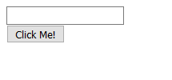
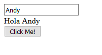

# Capítulo 1. Creando una glue app. #

La mejor forma de comprender la filosofía de trabajo de GluePHP es usándolo en la práctica. Para esto vamos a desarrollar una aplicación muy sencilla pero que servirá para mostrar muy bien los diferentes aspectos del proceso.

La aplicación estará compuesta por una caja de texto, una etiqueta y un botón. La lógica consistirá en que al hacer clic en el botón la etiqueta muestre un saludo con el nombre introducido por el usuario en el campo de texto.

## Introducción. ##

En el desarrollo con GluePHP existen identificados dos roles principales llamados **desarrollador de aplicación** y **desarrollador de componentes** respectivamente. Es bastante común que los desarrolladores se desempeñen en ambos roles de manera indiferente, pero en cada caso existen diferentes tipos de responsabilidades.

El desarrollador de aplicación, como su nombre lo indica, se encarga de realizar las partes del desarrollo relacionadas específicamente con las funcionalidades propias de la aplicación. Este rol se encarga de atender la estructura del proyecto, los controladores, la composición y la declaración y definición de eventos.

Por otra parte, el desarrollador de componentes, se encarga de desarrollar los componentes y otros recursos que serán usados por el desarrollador de aplicación.

Durante el desarrollo de este capítulo y con el objetivo de lograr la mejor explicación posible, primeramente nos desempeñaremos con el rol del desarrollador de aplicación y seguidamente con el del desarrollador de componentes. 

> Ninguno de los aspectos mostrados en los siguientes pasos tiene un carácter absoluto por lo que al realizar sus propios proyectos usted debe ser capaz de aplicarlos de acuerdo a sus necesidades.

## 1. Instalando GluePHP. ##

Recomendamos trabajar sobre un directorio vacío para tener un proyecto organizado.

	$ mkdir tutorial1
	$ cd tutorial1

Cree un archivo de nombre *composer.json* con el siguiente contenido:

	{
	    "require": {
	        "andaniel05/composed-views": "dev-0.1a",
	        "andaniel05/glue-php": "dev-0.1a"
	    }
	}

Seguidamente ejecute el comando:

	$ composer update

Una vez que halla finalizado la instalación cree un archivo de nombre *bootstrap.php* con el siguiente contenido:

```php
<?php

require_once 'vendor/autoload.php';
```

En este archivo vamos a definir las clases y funciones de la aplicación a medida que avancemos en el capítulo.

## 2. Controladores. ##

Una *glue app* necesita dos controladores web para su funcionamiento.

El primero de ellos se denomina **controlador de carga** ya que es el responsable de entregarle al navegador todo el código HTML de la página única, mientras que el segundo se denomina **controlador de procesamiento** y se encarga de procesar todas las solicitudes asíncronas(ajax) generadas desde el navegador.

La lógica de estos controladores es definida por el usuario, no obstante, es obligatorio que realicen ciertas operaciones para el correcto funcionamiento de la app.

> Si para el desarrollo de la app se está usando algún framework PHP de prósito general, estos controladores se deben crear de la misma manera en que se crean controladores en dicho framework.

### Creando el controlador de carga. ###

Cree un archivo con nombre *index.php* con el siguiente contenido:

```php
<?php

require_once 'bootstrap.php';

// Se instancia la app con sus componentes y eventos.
$app = require_once 'app.php';

// Antes de persistir la app es necesario esta sentencia.
$app->setBooted(true);

// Se persiste la instancia de la app donde en este caso la persistencia se hace
// mediante la sesión.
session_start();
$_SESSION['app'] = $app;

// Se imprime en el navegador el código HTML de la página.
$app->print();
```

Los comentarios del código muestran las respectivas funcionalidades. Como puede ver la instancia de la app se obtiene del archivo *app.php*. Es en este archivo donde estará definida toda la app.

### Creando el controlador de procesamiento. ###

Cree un archivo de nombre *process.php* con el siguiente contenido:

```php
<?php

require_once 'bootstrap.php';

use Andaniel05\GluePHP\Request\Request;

// Obtiene la instancia de la app persistida por el controlador de carga o por
// el procesamiento anterior.
session_start();
$app = $_SESSION['app'];

// La app procesa la solicitud y devuelve una respuesta.
$request = Request::createFromJSON($_REQUEST['glue_request']);
$response = $app->handle($request);

// Vuelve a persistir la app.
$_SESSION['app'] = $app;

// Envía al navegador la respuesta en formato JSON.
echo $response->toJSON();
die();
```

Como puede ver el código también está comentado.

## 3. Definiendo la app. ##

A partir de este paso es donde realmente comienza el desarrollo de nuestra app, pues crear los controladores fué crear la plataforma básica de ejecución y será siempre un paso obligatorio cuando se desarrolle cualquier *glue app* independientemente de su tamaño.

Como puede ver en *index.php* la variable $app espera un resultado del archivo *app.php*. Este resultado debe ser una instancia de la clase `Andaniel05\GluePHP\AbstractApp`.

Cree un archivo de nombre *app.php* con el siguiente contenido:

```php
<?php

/////////////////
// Composición //
/////////////////

// Instancia la app. El primer argumento especifica la ruta del controlador
// de procesamiento.
$app = new App('process.php');

// Instancia los componentes. El primer argumento especifica el identificador del componente.
$input = new Input('input');
$label = new Label('label');
$button = new Button('button');

// Inserta los componentes en la sección 'body' de la app.
$app->appendComponent('body', $input);
$app->appendComponent('body', $label);
$app->appendComponent('body', $button);

////////////////////////////
// Declaración de eventos //
////////////////////////////

// Declara que el evento 'click' del botón será manejado por la función 'clickButton'.
$button->on('click', 'clickButton');

return $app;
```

Primeramente se instancia la app donde el primer argumento se corresponde con la ruta del controlador de procesamiento. Como puede ver seguidamente existen dos bloques de comentarios llamados 'Composición' y 'Declaración de eventos' respectivamente.

La composición no es más que insertar en la instancia de la app las instancias de los componentes que estarán presentes en la misma, mientras que la declaración de eventos consiste en especificar las funciones encargadas de manejar los respectivos eventos de los componentes.

> La composición también puede efectuarse mediante código XML lo que reduce considerablemente la tarea, pero esto solo será posible si se está usando algún kit preparado para esto. Este tema será abordado en próximos capítulos.

Como se comenta en el código, lo que se hace para nuestra app es crear tres componentes e insertarlos en la sección 'body'. Además, se registra la función 'clickButton' como la manejadora del evento 'click' del botón.

Cada componente posee un identificador con el objetivo de que el mismo pueda ser referenciado desde cualquier parte del código. Por lo general este identificador es especificado por el usuario a través del constructor de la clase aunque esto depende del diseño de la respectiva clase, no obstante, si no se especifica ningún valor entonces el componente obtendrá un identificador por defecto.

## 4. Definiendo la lógica de los eventos. ##

> En el próximo capítulo podrá ver como usar *closures* para definir eventos en el mismo lugar que se declaran.

Una vez que se han declarado los eventos será necesario definir la lógica de los mismos. En el caso de nuestra app hemos declarado que el evento 'click' del botón será manejado por la función 'clickButton'. Para definir la lógica de este evento procedemos a crear dicha función.

Edite el archivo *bootstrap.php* y añada el siguiente código:

```php
function clickButton($event)
{
    // Referenciando los componentes de la app.
    $label = $event->app->label;
    $input = $event->app->input;

    $label->setText('Hola ' . $input->getText());
}
```

Toda función manejadora de eventos recibirá un argumento con información del evento en curso. Tal y como puede ver en el código, mediante este argumento se podrán referenciar los componentes dentro de la función.

En este caso la lógica es bien sencilla. La línea `$label->setText('Hola ' . $input->getText());` modifica el valor del texto del componente 'label' con la palabra 'Hola' más el valor del texto del componente 'input' y de esta forma se resuelve el requisito de nuestra aplicación.

Una vez llegado a este punto habremos terminado de desempeñarnos con el rol del desarrollador de aplicación. Como habrá podido notar, se han usado clases inexistentes para los componentes. Nuestro siguiente paso consiste en crear esas clases por lo que comenzaremos a desempeñarnos con el rol del desarrollador de componentes.

## 5. Creando la clase App. ##

El código HTML de la página será proporcionado por la clase App por lo que procedemos a crear dicha clase.

Edite el archivo *bootstrap.php* dejándolo de la siguiente manera:

```php
<?php

require_once 'vendor/autoload.php';

use Andaniel05\GluePHP\AbstractApp;

function clickButton($event)
{
    // Referenciando los componentes de la app.
    $label = $event->app->label;
    $input = $event->app->input;

    $label->setText('Hola ' . $input->getText());
}

class App extends AbstractApp
{
    public function html(): ?string
    {
        return <<<HTML
<!DOCTYPE html>
<html lang="en">
<head>
    <meta charset="utf-8">
    <title>Tutorial1 de GluePHP</title>
</head>
<body>
    {$this->renderSidebar('body')}

    {$this->renderAssets('scripts')}
</body>
</html>
HTML;
    }
}
```

Como puede ver hemos añadido al archivo el código fuente de la clase App. Puede notar que el método `App::html()` devuelve un valor de tipo *string* que se corresponde con el código HTML o vista de la página.

El significado de la línea `{$this->renderSidebar('body')}` consiste en que en esa posición serán mostrados los componentes de la sección 'body' de la página. En la clase `Andaniel05\GluePHP\AbstractApp` existe registrado por defecto la sección 'body' pero en próximos capítulos se mostrará la forma de crear nuevas secciones.

Por otra parte hay que destacar también el significado de la línea `{$this->renderAssets('scripts')}` la cual provocará que en esa posición se muestren los recursos de tipos *scripts* de la página. Si esta línea es omitida el código HTML de la página no contendrá las fuentes JavaScript necesarias para que la app pueda funcionar correctamente, por lo que mostrar los *assets* de este tipo tiene un carácter obligatorio.

También más adelante profundizaremos en el tema de los *assets*.

## 6. Creando las clases de los componentes. ##

Es en la creación de componentes donde GluePHP ofrece sus mayores bondades ya que de una manera declarativa se indica como debe ser tratado el componente por parte del framework.

Para crear un componente es necesario crear primeramente una clase descendiente de `Andaniel05\GluePHP\Component\AbstractComponent` donde al igual que en la clase App, el código HTML o vista se especifica a través de su método `html()`. Para el caso del código HTML de los componentes GluePHP ofrece cierto marcado especial para indicar la realización de ciertas tareas comunes relacionadas con los elementos HTML del componente.

Por otra parte, mediante la anotación `@Glue` se especifican los datos compartidos y sincronizados entre las instancias de los componentes backend y frontend.

Añada la declaración de la clase `Andaniel05\GluePHP\Component\AbstractComponent` al inicio del archivo *bootstrap.php*:

```php
<?php

require_once 'vendor/autoload.php';

use Andaniel05\GluePHP\AbstractApp;
use Andaniel05\GluePHP\Component\AbstractComponent;

// ...
```

### Creando la clase Input. ###

Añada el siguiente código al archivo *bootstrap.php*:

```php
class Input extends AbstractComponent
{
    /**
     * @Glue
     */
    protected $text;

    public function html(): ?string
    {
        return '<input type="text" gphp-bind-value="text">';
    }
}
```

Primeramente vamos a explicar el significado del atributo 'text' marcado con la anotación `@Glue`. Como habíamos explicado antes, por cada instancia de componente presente en la app, GluePHP creará una instancia equivalente en el frontend. La existencia de esta anotación sirve para indicar que la instancia del componente frontend tendrá también un atributo de nombre 'text' y que mantendrá un *Double Binding* con igual atributo del componente backend, es decir, que cuando dicho atributo modifique su valor en cualquiera de las partes la otra será actualizada automáticamente. Los atributos que presenten la anotación `@Glue` son llamados *glue attributes*.

Respecto al código HTML del componente, en este caso se corresponde con un único elemento 'input' pero es muy importante aclarar que el método puede devolver cualquier fragmento de código HTML. El atributo `gphp-bind-value="text"` forma parte del marcado especial de GluePHP comentado anteriormente. De esta forma se indica que ese elemento mantendrá un *Double Binding* entre su valor y el valor del *glue attribute* 'text'.

### Creando la clase Label. ###

Añada el siguiente código al archivo *bootstrap.php*:

```php
class Label extends AbstractComponent
{
    /**
     * @Glue
     */
    protected $text;

    public function html(): ?string
    {
        return '<label gphp-bind-html="text"></label>';
    }
}
```

Como puede ver la clase Label es muy similar a la clase Input. Ambas cuentan con un *glue attribute* llamado 'text' y solo difieren en su código HTML. En el caso de esta clase su vista no es más que un elemento tipo 'label' con el atributo `gphp-bind-html="text"`. El significado de este atributo es muy similar al anterior, la única diferencia está en que en este caso el *Binding* solo se va a producir desde el *glue attribute* hacia el HTML interno del  elemento 'label'.

### Creando la clase Button. ###

Añada el siguiente código al archivo bootstrap.php:

```php
class Button extends AbstractComponent
{
    /**
     * @Glue
     */
    protected $text = 'Click Me!';

    public function html(): ?string
    {
        return '<button gphp-bind-html="text" gphp-bind-events="click"></button>';
    }
}
```

Como puede ver, la clase Button cuenta también con un *glue attribute* 'text' donde en este caso presenta un valor por defecto. En el caso de la vista no es más que un elemento tipo 'button' que presenta dos atributos especiales.

En el caso del atributo `gphp-bind-html="text"` el significado es exáctamente el mismo que en la clase Label. La única diferencia está en que el *glue attribute* presenta un valor por defecto pero esto no provoca ningún resultado diferente al esperado. Es decir, al crear una instancia de esta clase por defecto el botón mostrará el texto 'Click Me!'.

La principal diferencia de esta clase con las demás radica en la existencia del atributo `gphp-bind-events="click"` presente en el elemento 'button'. Este atributo le dice a GluePHP que al hacer clic sobre el botón se debe disparar en el servidor el evento 'click' del respectivo componente. Recordemos que en la composición de nuestra app, insertamos una instancia de esta clase cuyo identificador fué 'button', además registramos la función 'clickButton' como la encargada de manejar su evento 'click'.

> En próximos capítulos se profundizará en el tema de la creación de componentes.

## Ejecutando la app. ##

Una vez llegado a este punto habremos terminado de desarrollar nuestra app por lo que procedemos a su ejecución.

Como toda aplicación web nuestra app necesita ser ejecutada por un servidor web. Por razones de simplicidad recomendamos usar el servidor que viene integrado por defecto en PHP.

Ejecute el siguiente comando:

	$ php -S localhost:8080

Puede cambiar el puerto según su conveniencia.

Ahora accedemos a la URI [http://localhost:8080/](http://localhost:8080/) y obtendremos el siguiente resultado:



Seguidamente introducimos un nombre en la caja de texto y al hacer clic sobre el botón podremos comprobar que el label pasa a mostrar el saludo esperado tal y como se muestra en la siguiente imagen.



Es muy importante destacar que el proceso se realiza sin recargar la página.

## Conclusiones. ##

Con el presente capítulo se ha mostrado la forma de trabajo de GluePHP mediante la realización de una aplicación de prueba muy sencilla. Los aspectos mostrados pueden ser aplicados en la construcción de aplicaciones de mayor escala.

GluePHP se usa para la creación de aplicaciones web de una sola página(SPA) mediante el paradigma de la programación dirigida por eventos puramente desarrollada en PHP. El desarrollo con GluePHP es muy similar al desarrollo de una aplicaciones con interfaces gráficas(GUI) para el desktop o móviles.

Los desarrolladores afrontan dos roles denominados **desarrollador de aplicación** y **desarrollador de componentes** respectivamente. Los componentes se pueden distribuir de forma independiente.

GluePHP constituye una plataforma de nivel superior sobre la cual se ejecutan las aplicaciones. Gracias a esta plataforma el desarrollador se centra en la lógica de la aplicación y no tiene que atender temas como la gestión de solicitudes asíncronas(ajax), etc. Es por esto que contribuye a desarrollar más con PHP y menos con JavaScript.


