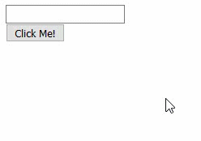

# Capítulo 3. Uso dinámico de componentes. #

La composición de las aplicaciones hechas con GluePHP tienen un comportamiento dinámico. Esto quiere decir, que en cualquier momento se pueden insertar, eliminar y/o modificar componentes independientemente de si la aplicación ha sido cargada ya o no.

Para mostrarle este comportamiento vamos a desarrollar una aplicación muy similar a la anterior solo que en este caso estará compuesta solo por una caja de texto y un botón. La lógica de la misma consistirá en que al presionar el botón se insertará un nuevo botón con el texto introducido por el usuario en la caja de texto. Por otra parte, cuando este nuevo botón sea presionado deberá ser eliminado completamente.

>En el archivo [app3.zip](https://github.com/andaniel05/GluePHP/raw/0.1a/doc/res/Cap3/app3.zip) encontrará resuelto el ejercicio de este capítulo.

## 1. Definiendo la app. ##

Edite el archivo *app.php* de la siguiente manera:

```php
<?php

/////////////////
// Composición //
/////////////////

$app = new App('process.php');

$input = new Input('input');
$button = new Button('button');

$app->appendComponent('body', $input);
$app->appendComponent('body', $button);

////////////////////////////
// Vinculación de eventos //
////////////////////////////

$button->on('click', 'clickButton');

return $app;

```

## 2. Definiendo la lógica de los eventos. ##

Modifique la función 'clickButton' de la siguiente forma:

```php
function clickButton($e)
{
    $newButton = new Button;
    $newButton->setText($e->app->input->getText());
    $newButton->on('click', 'clickNewButton');

    $e->app->appendComponent('body', $newButton);
}
```

Como puede verse primeramente se crea la nueva instancia de la clase Button, se le asigna el texto introducido por el usuario en la caja de texto y se declara que su evento 'click' será manejado por la función 'clickNewButton'. Más tarde se añade el componente a la sección 'body' de la página.

El siguiente paso consiste en definir la función 'clickNewButton'. Para ello añada el siguiente código al archivo *bootstrap.php*:

```php
function clickNewButton($e)
{
    $button = $e->component;
    $button->detach();
}
```

Como puede ver en el código anterior, mediante el argumento pasado a la función manejadora de eventos se puede obtener también el componente causante del evento en curso. Esta referencia se obtiene a través del atributo especial 'component' de dicho argumento. Cuando se ejecuta la sentencia `$button->detach();` el componente quedará totalmente separado de la instancia de la app lo que provocará su eliminación.

>Los *glue components* tienen una estructura jerárquica. Esto quiere decir que pueden contener un padre y varios hijos. Cuando se invoca el método `$component->detach()` se le indica al componente padre(en caso de que exista) que debe eliminar al actual como uno de sus hijos. De manera equivalente, si sobre un componente se ejecuta el método `$component->dropChild('child')` se eliminará del componente con identificador 'child' la referencia al componente actual como su padre.

## 3. Ejecutando la aplicación. ##

De esta forma habrá quedado implementada la app y para comprobar su funcionamiento procedemos a su ejecución.



