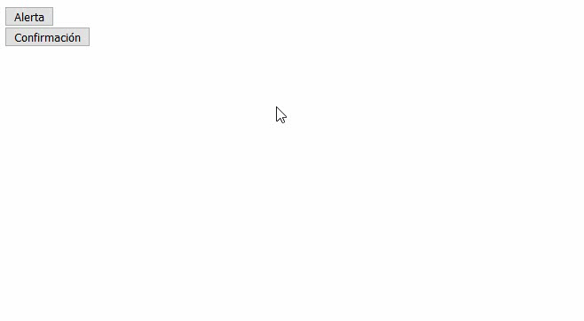

# Capítulo 4. Acciones. #

Como la interfaz de una *glue app* se ejecuta en un navegador web y la lógica de sus eventos se procesa en un servidor, existe un mecanismo de envío de mensajes instantáneos desde el servidor al navegador, con el objetivo de que el navegador reaccione instantáneamente ante las órdenes emitidas por el servidor. A estos mensajes se les conoce como acciones en GluePHP y constituyen el pilar fundamental de la comunicación en ese sentido.

Cuando en una *glue app* se dispara un evento en alguno de sus componentes, se envía al controlador de procesamiento una solicitud ajax que entre otra información contiene el nombre del evento que se debe procesar en el servidor. Si durante la ejecución de la lógica del respectivo evento se envía alguna acción, lo que internamente sucede es que se escribe en la salida al navegador los datos de la respectiva acción sin que esto termine la solicitud ajax actual, es decir que dicha solicitud pasa a ser de tipo *streaming*. De esta forma se garantiza que el navegador sea notificado de la ocurrencia de la acción casi inmediatamente en que esta es emitida por el servidor.

Las acciones tienen un protagonismo esencial en el funcionamiento interno de las *glue apps* y muchas de las características que hemos visto hasta el momento hacen uso de las mismas. Por ejemplo cuando el valor de un *glue attribute* cambia en el servidor, GluePHP envía una acción para que su equivalente sea actualizado en el navegador instantáneamente. Otro caso en el que está presente su uso es en la inserción y eliminación dinámica de componentes mostrada en el capítulo anterior.

En este capítulo mostraremos la creación de acciones personalizadas y su forma de envío. Para ello vamos a desarrollar una aplicación compuesta por dos botones donde el primero mostrará el texto 'Alerta' mientras que el segundo 'Confirmación'. El funcionamiento consistirá en que cuando se haga clic en el botón 'Alerta' se muestre en el navegador un mensaje de alerta nativo y de igual forma, cuando se presione el botón 'Confirmación' el navegador mostrará un mensaje de confirmación nativo donde los textos de los mensajes en todos los casos serán aleatorios.

>En el archivo [app4.zip](https://github.com/andaniel05/GluePHP/raw/0.1a/doc/res/Cap4/app4.zip) encontrará resuelto el ejercicio de este capítulo.

## 1. Definiendo la app. ##

Edite el archivo *app.php* de la siguiente manera:

```php
<?php

/////////////////
// Composición //
/////////////////

$app = new App('process.php');

$alertButton = new Button('alert_button');
$alertButton->setText('Alerta');

$confirmationButton = new Button('confirmation_button');
$confirmationButton->setText('Confirmación');

$app->appendComponent('body', $alertButton);
$app->appendComponent('body', $confirmationButton);

////////////////////////////
// Vinculación de eventos //
////////////////////////////

$alertButton->on('click', 'clickAlertButton');
$confirmationButton->on('click', 'clickConfirmationButton');

return $app;

```

## 2. Definiendo la lógica de los eventos. ##

Añada las siguientes funciones al archivo *bootstrap.php*:

```php
function clickAlertButton($e)
{
    $text = uniqid();
    $action = new CustomAction($text, 'alert');
    $e->app->act($action);
}

function clickConfirmationButton($e)
{
    $text = uniqid();
    $action = new CustomAction($text, 'confirmation');
    $e->app->act($action);
}
```

Para enviar una acción primeramente es necesario crear una instancia del tipo de acción a enviar y especificarle sus datos según corresponda. Seguidamente se debe invocar sobre la instancia de la app la llamada al método `act()` con la instancia de la acción a enviar como argumento.

Como puede ver, en las funciones anteriores se hace uso de la clase CustomAction la cual no ha sido definida aún, por lo que nuestro próximo paso consiste en crear dicha clase.

## 2. Creando la clase de la acción. ##

Para crear un nuevo tipo de acción es necesario crear una clase que descienda de `Andaniel05\GluePHP\Action\AbstractAction` por lo que primeramente debemos declarar el uso de la misma al inicio del archivo *bootstrap.php*:

```php

// ...
use Andaniel05\GluePHP\Action\AbstractAction;

```

Añada la siguiente clase al archivo *bootstrap.php* que se corresponde con la implementación de nuestra acción:

```php
class CustomAction extends AbstractAction
{
    public function __construct(string $text, string $type)
    {
        parent::__construct([
            'text' => $text,
            'type' => $type,
        ]);
    }

    public static function handlerScript(): string
    {
        return <<<JAVASCRIPT
if (data.type == 'alert') {
    alert(data.text);
} else if (data.type == 'confirmation') {
    confirm(data.text);
}
JAVASCRIPT;
    }
}
```

En la clase `Andaniel05\GluePHP\Action\AbstractAction` existe un método estático y abstracto de nombre `handlerScript()` por lo que toda clase heredera está obligado a implementarlo. Este método debe devolver el fragmento de código JavaScript que será ejecutado en el navegador una vez que se reciba una acción de este tipo.

Al mirar el código JavaScript de nuestra clase puede notar que se hace uso de una variable de nombre `data` y puede notar también que sobre la misma se hace referencia a las propiedades `text` y `type`. Por otra parte, si mira el constructor de la clase puede comprobar que el constructor de la clase padre es invocado con un *array* que contiene dos valores indexados por las claves `text` y `type`. En la clase `Andaniel05\GluePHP\Action\AbstractAction` existe un atributo especial y protegido de nombre `$data` donde su valor se especifica a través del constructor de la misma. Cuando una acción es enviada, GluePHP hace una conversión automática del valor de este atributo y lo asigna a la variable `data` del código JavaScript donde la conversión tiene en cuenta los siguientes casos:

- Cuando el tipo del atributo sea escalar la variable tomará un tipo similar pues los tipos escalares de PHP existen también en JavaScript.
- Cuando el tipo del atributo sea un *array* tipo vector(solo índices numéricos y ordenados) el tipo de la variable será una instancia de la clase `Array`.
- Cuando el tipo del atributo sea un *array* tipo *hash*(índices de cadenas de caracteres) el tipo de la variable será un objeto con propiedades equivalentes a los índices del array.
- Cuando el tipo del atributo sea un objeto el tipo de la variable será también un objeto.

De esta forma GluePHP le hace muy sencillo al programador implementar la comunicación en el sentido del servidor al navegador ya que el trabajo se reduce a especificar los datos a enviar y a escribir el código JavaScript.

>Es importante mencionar que el código JavaScript recibe también una variable de nombre `app` que contiene la instancia de la app en el navegador.

Como puede ver la acción que hemos programado requiere dos valores de tipo *string* donde el primero de ellos se corresponde con el texto del mensaje mientras que el segundo constituye el tipo de alerta. La lógica del código JavaScript consiste en mostrar un mensaje tipo 'alert' si el valor de la propiedad `data.type` es igual 'alert' y tipo 'confirm' en el caso de que `data.type` sea igual a 'confirm'. Tenga en cuenta que la desición del tipo de mensaje a mostrar se toma en el navegador.

## 3. Ejecutando la aplicación. ##

Si procedemos a ejecutar la aplicación esta debe funcionar de la siguiente manera:



