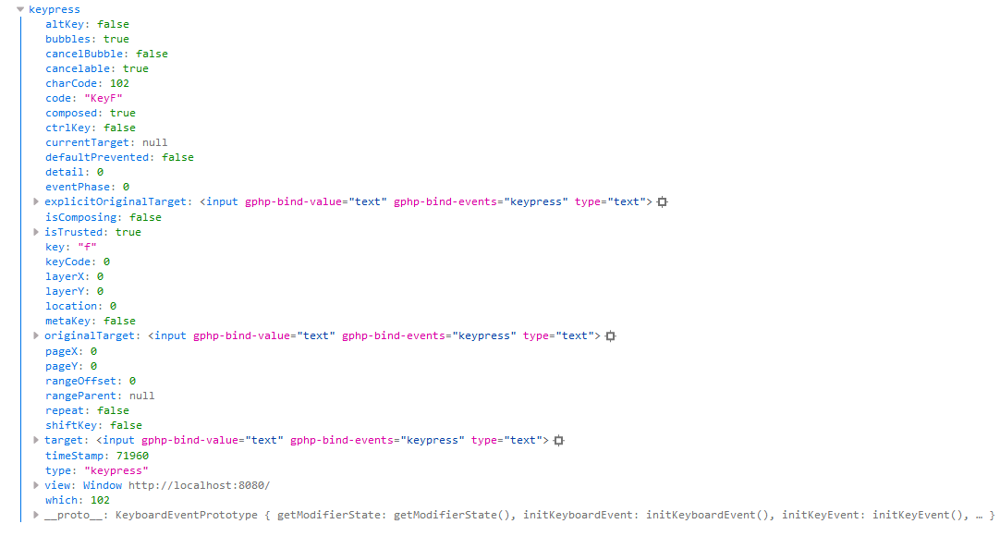
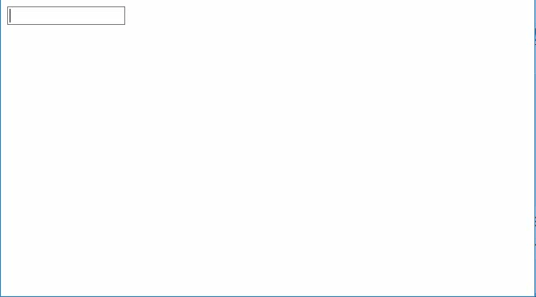

# Capítulo 5. Trabajando con datos de los eventos frontend. #

Resulta bastante común que la lógica de un evento dependa de cierta información del evento en curso. Como en una *glue app* su interfaz se ejecuta en el navegador y la lógica en el servidor, cuando se produce un evento es necesario enviar al servidor la información necesaria para el funcionamiento del mismo.

En este capítulo vamos a desarrollar una aplicación compuesta solo por una caja de texto donde su funcionamiento consistirá en que cuando se introduzca un caracter, se muestre un mensaje de alerta indicando que se ha introducido una letra o un número según sea el caso.

>En el archivo [app5.zip](https://github.com/andaniel05/GluePHP/raw/0.1a/doc/res/Cap5/app5.zip) encontrará resuelto el ejercicio de este capítulo.

Cuando se produce un evento en el navegador, este proporciona un objeto que contiene una gran cantidad de información al respecto. Teniendo en cuenta que generalmente son solo unos pocos datos los que se necesitan en la lógica, GluePHP da la posibilidad al usuario de especificar por cada evento la información necesaria a enviar.

## 1. Editando la clase del componente Input. ##

Cuando anteriormente definimos la clase del componente Input no declaramos que este tipo de componente iba a lanzar algún tipo de eventos. Para implementar nuestra app necesitamos que este tipo de componente sea capaz de lanzar un evento relacionado con la pulsación de teclas.

En el archivo *bootstrap.php* edite la clase Input de la siguiente manera:

```php
class Input extends AbstractComponent
{
    /**
     * @Glue
     */
    protected $text;

    public function html(): ?string
    {
        return '<input type="text" gphp-bind-value="text" gphp-bind-events="keypress">';
    }
}
```

Al especificar el atributo `gphp-bind-events="keypress"` sobre el elemento declaramos que el evento 'keypress' del elemento `input` producirá el evento de igual nombre en el componente.

## 2. Definiendo la app. ##

Edite el archivo *app.php* de la siguiente manera:

```php
<?php

/////////////////
// Composición //
/////////////////

$app = new App('process.php');
$input = new Input('input');

$app->appendComponent('body', $input);

////////////////////////////
// Vinculación de eventos //
////////////////////////////

$input->on('keypress', 'onKeyPress', ['key', 'charCode']);

return $app;
```

Puede notar que en la vinculación del evento 'keypress' del componente 'input' se especifica un *array* como tercer argumento. De esta forma se declara que cuando se produzca el evento 'keypress' del componente se envíe al servidor los datos 'key' y 'charCode' del objeto del evento proporcionado por el navegador.

En la siguiente imagen se ha impreso en la consola del navegador, el objeto del evento 'keypress' obtenido al producirse dicho evento en un elemento 'input'. De esta forma puede comprobar la disponibilidad de los datos 'key' y 'charCode' para ser enviados al servidor.



## 3. Definiendo la lógica del evento. ##

Añada la siguiente función al archivo *bootstrap.php*

```php
function onKeyPress($e)
{
    $data = $e->getData();

    if ($data['charCode'] >= 97 && $data['charCode'] <= 122) {
        $alert = new CustomAction("Es la letra {$data['key']}", 'alert');
        $e->app->act($alert);
    } elseif ($data['charCode'] >= 48 && $data['charCode'] <= 57) {
        $alert = new CustomAction("Es el número {$data['key']}", 'alert');
        $e->app->act($alert);
    }
}
```

Como puede ver, a través del método `$e->getData();` se obtienen los datos del evento en curso enviado desde el navegador. El valor devuelto es un *array* asociativo donde sus claves se corresponden con los datos enviados.

## 4. Ejecutando la aplicación. ##


